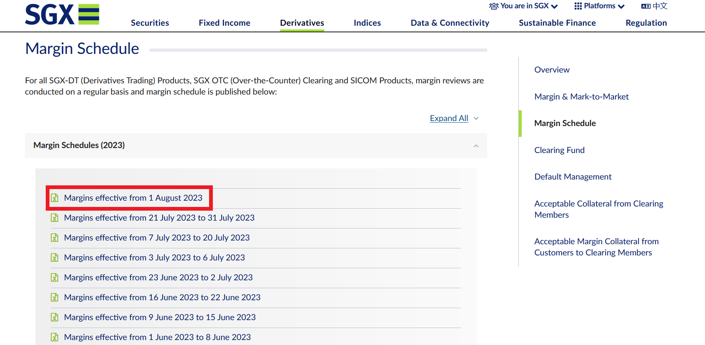
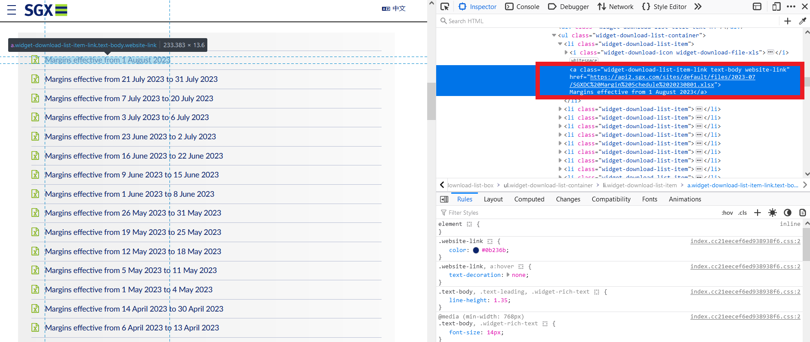

* Table of Contents
{:toc}

--------------------------------------------------------------------------------------------------------------------

## **Acknowledgements**

* This application makes use of [Selenium 4.9.1](https://www.selenium.dev/), an open source library for browser automation.
* This application uses MS Edge WebDriver version 115 as the browser driver.
* This application and related guides are created by Kok Hai, Software Intern at Phillip Nova, in tandem with Xiao Tian, Operations and Settlements Department.

--------------------------------------------------------------------------------------------------------------------

## **Setting up, getting started**
For Windows:
1. Download the latest version of [Python 3 for Windows](https://www.python.org/downloads/).
2. Check that the Python installation is successful by running the following command in terminal:
    
    `python --version`

3. Install the latest version of Selenium with the following command: 

    `pip install selenium`

   You may consider installing the packages into a [venv](https://docs.python.org/3/library/venv.html) to prevent cluttering your base installation of Python.
4. Edge should be installed on your Windows PC. Otherwise, install it from the Microsoft Store
5. Check the version of your Edge browser. Type (or copy and paste) `edge://version` into the Edge browser address bar and press Enter.
6. If it is no longer version 115, download a new [MS Edge WebDriver](https://developer.microsoft.com/en-us/microsoft-edge/tools/webdriver/) and place the driver in the `./driver` directory.

--------------------------------------------------------------------------------------------------------------------

## **Structure of Dictionary**
The list of margin websites and the elements to be scraped are defined in a dictionary that is generated with the `generateDict` function.

The dictionary takes in the `exchange name` as the KEY and a list of 3 objects as the VALUE. The first object in the list is the `url`, followed by the `css element` on the webpage and the `index` of the element on the webpage.

Example: 
- KEY = 'CME'
- VALUE = ['https://www.cmegroup.com/clearing/margins/outright-vol-scans.html#sortField=exchange&sortAsc=true&pageNumber=1','a.btn.download-margins', 0]

### How does the code make use of the dictionary?
Apart from exchange websites (ENPAR, CME, TIFEX, KSE) that require unique additional steps to scrape, the trivial case is when the download link to the margin document is accessible directly by selecting it through its CSS properties. 

Examples of CSS elements used:
- For SGX, `css element` = `'a[href$=".xlsx"]'`, `index` = `0`. This clicks the first download link to a '.xlsx' document found on the website.
- For IFSG, `css element` = `'a[href*="ICSG_MARGIN_SCANNING"]'`, `index` = `0`. This clicks the first download link containing "ICSG_MARGIN_SCANNING" in its name.
- For ENPAR, `css element` = `'a[href*="noticecash_derives"]'`, `index` = `1`. This clicks the second download link containing "noticecash_derives" in its name.

For each website, a suitable and specific CSS element should be chosen to download the latest uploaded Margin Update document. 

### How to derive the `css element` and `index` for a `url`?
1. Enter the website and find the link or button that a user will click to download the document usually.

2. Right-click on the link or button and press `Inspect` to open up the Inspector and reveal the source code for the element.

3. Observe if there are any unique identifiers for this element - noting that the name of the document is likely to change as with each update.
   3.1 For example, note the file type of the download link, if it is `'.xlsx'` or `'.xls'`. If the Margin Update download link is the only such link on the entire webpage, using just the `'a[href$=".xlsx"]'` is sufficient to identify it uniquely.
   3.2 If a `css element` that uniquely identifies the download link is found, use `0` as the index value.
   3.3 If the `css element` identifies multiple links and the latest Margin Update document is not the first link, check if the sequence of the links is fixed. If it is fixed you can use the appropriate index to access the correct link.
4. Note if there are any additional steps you need to take to access the download link like logging into an account or selecting certain parameters. You will need to write additional logic in the `download_files` function for these websites.

--------------------------------------------------------------------------------------------------------------------

## How to create an executable for distribution to end user?
By creating a standalone executable for the application, it becomes simple for the user to run it without needing any software dependencies (i.e. Python, Selenium or the WebDriver). Additionally, it abstracts away access to the source code which prevents the end user from inadvertently changing and potentially breaking the code.

However, this means that a developer is required to maintain the function of the code and repackage the binary any time the following updates are required.
1. If new logic needs to be added to the source code, a new executable needs to be repackaged. For example, a new exchange is to be included, or an existing website's layout is changed.
2. Since a fixed driver version used to create the executable, if there is a version update to the business users' Microsoft Edge, the executable needs to be repackaged with the new version of the WebDriver.

### Steps for creating the executable:
1. Install `pyinstaller` with the following command:

   `pip install pyinstaller`

2. Save the `margin_scraper.py` Python script.
3. Check that the version Edge WebDriver in the `./driver` directory matches that of the end user.
4. Create the standalone executable by running the following command in the main directory containing the `margin_scraper.py` script:

    ` pyinstaller ".\margin_scraper.py" --onefile --add-binary "./driver/msedgedriver.exe;./driver"`

5. After successfully running the command, the new directories, `build` and `dist`, and a new file, `margin_scraper.spec` should appear.
6. `build` and `margin_scraper.spec` are non-essential and can be removed.
7. The executable to be distributed to the end user can be found in the `dist` directory.

--------------------------------------------------------------------------------------------------------------------

## **Retaining Browser User Data**
For CME exchange, the user needs to be logged in to download the margin update document. By default, a temporary profile is created at each launch of the Selenium MSEdge WebDriver which means that the user will need to log in to the website every single time. 

To overcome this, every time the programme is run, a copy of the User Data for Edge (located at `"C:\\Users\\UserName\\AppData\\Local\\Microsoft\\Edge\\User Data"`) is made in the `./temp` directory. The user simply has to be logged in to the websites on their usual Edge browser, and the programme will use the copied profile (with all cookies, bookmarks, logins etc.) to run the scraping. At the start and at the end of the programme, the `./temp` directory is cleared.

### Potential Issues
1. If the user's saved data on the Edge browser is massive, creating and deleting the user data in the temp directory requires a lot of time and space. 
2. Currently, the application uses the "Default" profile in the initialisation of the programme.

    `edge_options.add_argument("profile-directory=Default")`

   If the user has multiple profiles, the correct one will need to be specified in the source code.

## **Logging for Troubleshooting**
By default, logging is turned off. To turn on logging, go to the `main` function and change the `init_logger` function call to use `save_logs=False`. This will store logs locally at `./Logs` instead of just printing to stdout. The logs will be furnished with more information than stdout such as the time and level name of each log. 
